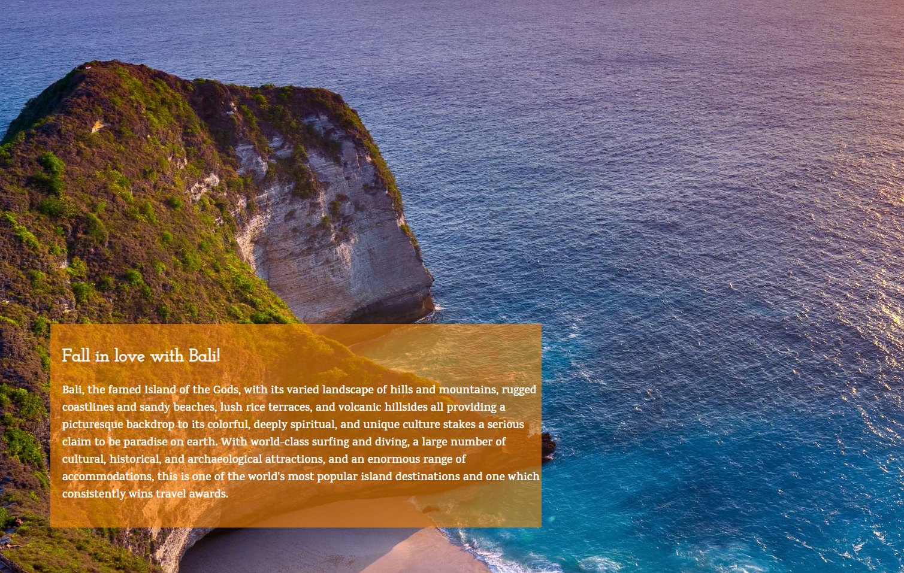
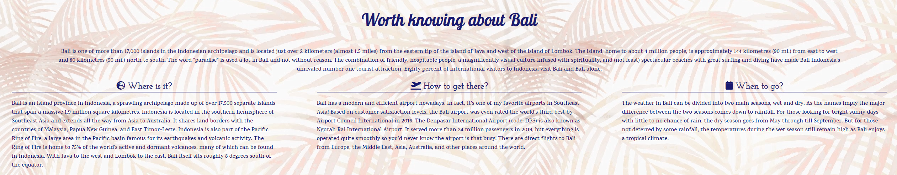
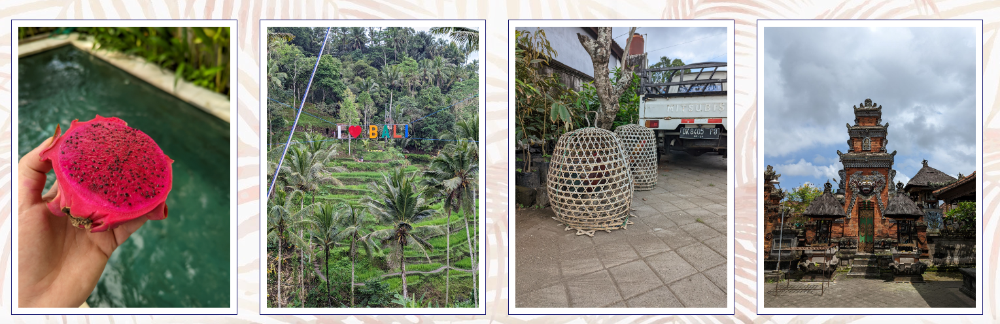
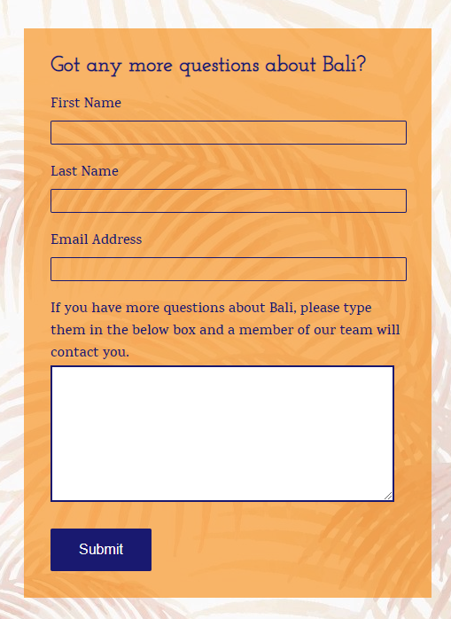
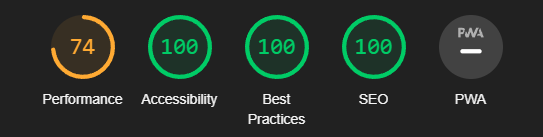

# Travel to Bali

Travel to Bali is a tourism website about island of Bali, Indonesia.

Users of this website will be able to find usefull information such as places worth seeing, a photo gallery including promotional video of Bali,  
things worth knowing such as, weather tips, information on flights and location of the island on a world map.
This website is targeted to all people interested in visiting Bali either for a short term stay or long holiday.

## Features
*** 
- Navigation
    * Located at the top of the page, navigation shows website logo in the left corner, that when clicked sends you to landing page.
    * Also located at the top of the page in the centre located are other links: Home, Places, Gallery and Contact us linking different sections of the page.
    * Navigation bar is easy to find at the top of the page and consistent throughout all the sections, font is clear and well contrasting with the background.
    * Navigation links cleary label sections of the page e. g. Gallery opens a photo gallery section, while Contact Us opens contact form section.
***

- Hero image
    * Hero image section shows a backgroud photo of a Kelingking Beach with a zoom out animation on page load.
    * Hero image also has an overlay giving a quick overview of Bali island for the visitors.
***

- Worth knowing about Bali section
    * This section gives user a quick overview and short description of Bali
    * It's split in 3 parts, Where is it?, How to get there? & When to go? Aiming at giving the user information about location of the island, flight connections and best time of the year to travel to Bali.
***

- Google map of Bali
    * This part of landing page contains embedded section of a google map showing the island of Bali.

- Places page
    * This page gives user ability to see main attractions in Bali.

- Gallery page 
    * This page contains an embedded YouTube player containing a promotional video of tourism in Bali, as well as a gallery of photos that react when hovered over.
***

- Contact Us
    * This page contains a small form users can submit with questions about Bali.
***

## Testing

- I tested the website in 3 major browsers, Chrome, Edge and Firefox.
- I confirmed that navigation bar, active page highlight, and home link in the page logo work.
- I checked that everything is easily readable and contrast is satisfactory.
- I tested that form accepts appropriate data and will not submit without populating required fields.

## Bug fixing

- After page deployment I discovered none of my attached photographs as well as backgroud image was displaying.
    * To fix the issue I began checking the file paths of the images.
    * After reaching out to google for help I found that my image paths were coded as "absolute" instead of "relative"
    * Removing "/" from the front of file path resolved the issue.

## Validating the code

- HTML
    * No errors were returned when passing through official W3C validator.

- CSS 
    * No errors were returned when passing through official W3C validator.

- Accessibility 
    * I confirmed that fonts and colors used are easily readible by running Lighthouse utility in devtools.
***

## Deployment

- The page was deployed using GitHub Pages utility.

## Credits

- Content
    * The code for social media links was taken from the CI [Love Running](https://github.com/Karolsz55/love_running) project.
    * The code for contact form was taken from the CI [Love Running](https://github.com/Karolsz55/love_running) project.
    * The code for gallery page grid was taken from [Code-boxx](https://code-boxx.com/responsive-image-gallery-html-css/).
- Media 
    * The photo for "Sacred Monkey Forest" in Places section was taken from (https://www.freepik.com/)
    * The background photo on landing page was taken from (https://www.pexels.com/pl-pl/)
    * All other photographs uploaded were taken from my own private gallery.
    * YouTube video in the gallery page was taken from official profile of (https://www.youtube.com/@WonderfulIndonesiaOfficial)